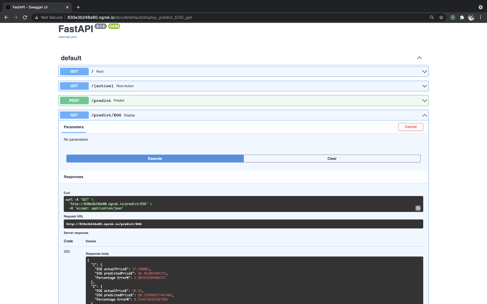

# Oil & Gas Stock Analysis
> Project to analyze and predict stock prices of Oil & Gas companies.
> Live demo on Google Colab [_here_](https://colab.research.google.com/drive/1UOWdKPuTLisIdHn3CGGJT1mKmYGAaJNQ?usp=sharing). <!-- link to hosted project -->

## Table of Contents
* [General Info](#general-information)
* [Technologies Used](#technologies-used)
* [Features/Insights Generated](#features-insights-generated)
* [Screenshots](#screenshots)
* [Setup](#setup)
* [Usage](#usage)
* [Project Status](#project-status)
* [Room for Improvement](#room-for-improvement)
* [Acknowledgements](#acknowledgements)
* [Contact](#contact)
* [License](#license)

## General Information
- I applied ETL process for 4 Oil & Gas companies’ stock prices (XOM, CVX, COP, EOG) historical data from Yahoo Finance and analyzed the data.
- I built and deployed Deep Learning model to make prices prediction as a Microservice using Python FastAPI.
- I decided to choose Exxon Mobil Corporation (XOM), Chevron Corporation (CVX), ConocoPhillips (COP), and EOG Resources, Inc. (EOG) as my 4 stock prices to work on because they are among the largest and most dominant companies in the Oil & Gas industry of the United States. Therefore, I think it would be very fascinating to predict, analyze and obtain some insights about their stock prices.

## Technologies Used
- Python - version 3.9
- Python FastAPI - version 0.65.2
- Tensorflow - version 2.5

## Features Insights Generated
- Correlation Matrices showed the relationship among the targeted stocks.
- Price prediction for EOG stock by a Neural Network model using Tensorflow and deployed using Python FastAPI.

## Screenshots

## Setup
The project requirements/dependencies are listed in [_requirements.txt_](./requirements.txt) in this project.

## Usage
The code was generated by Google Colab, to try out this project: go to [_this project Google Colab link_](https://colab.research.google.com/drive/1UOWdKPuTLisIdHn3CGGJT1mKmYGAaJNQ?usp=sharing), make a copy then explore with the [_originalStock.csv_](./originalStock.csv) in this project.  

## Project Status
Project is: _in progress_ for improvement.

## Room for Improvement
Room for improvement:
- Improvement by working on the the front end
- Deploy this project using Docker or others

To do:
- Work on React 
- Learn and apply Docker

## Acknowledgements
This project was inspired by many Data Scientists working at the Hewlett Packard Enterprise Data Science Institute and in Oil & Gas industry. 

## Contact
Created by Anh Nguyen - [aqnguy30](https://github.com/aqnguy30) - quocanh191997@gmail.com - feel free to contact me! 

## License
This project is open source and available under the [Apache License 2.0](./LICENSE). 

